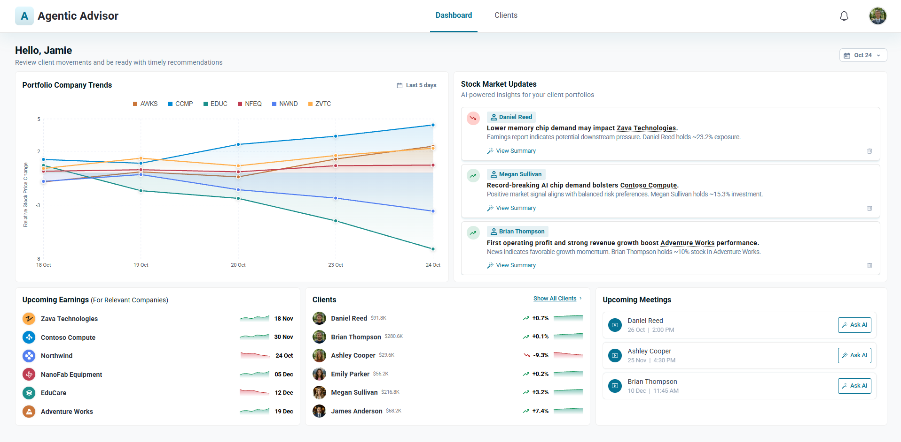
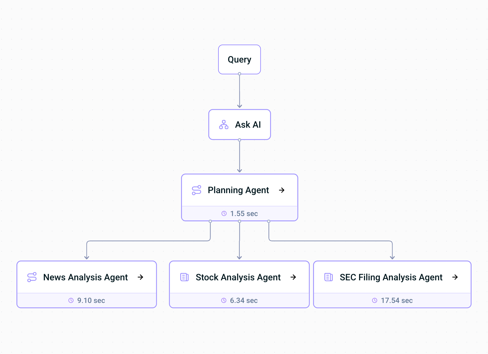
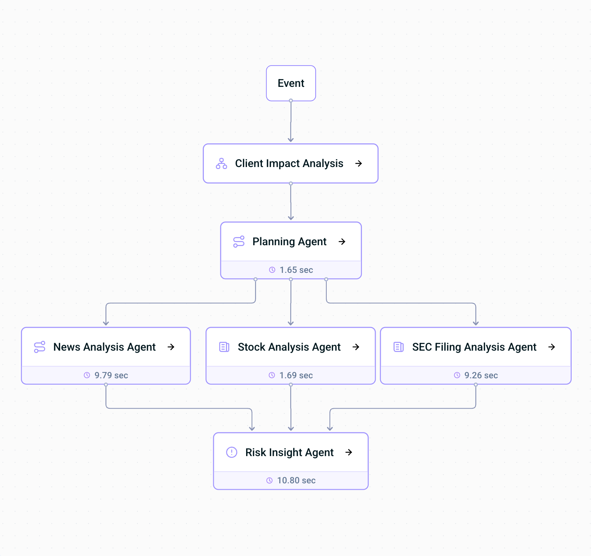

# 📈 Agentic Advisor: AI-Powered Financial Advisory at Your Fingertips

> **See multi-agent AI make proactive, personalized investment decisions**

Agentic Advisor is a GenAI-powered financial advisory demo that showcases how **multi-agent workflows**, powered by [LangChain](https://www.langchain.com/), can drive **proactive, personalized investment advice**. It combines a **company relationship graph** (Apache AGE), **RAG over 10-K filings and news articles**, **historical stock data**, and **persistent client memory** (Mem0), all deployed on Azure in minutes with the **Azure Developer CLI**.

Watch intelligent agents detect indirect risk from connected companies *before* it shows up in a stock the client owns, capture client preferences in natural language, and see a Planner Agent selectively trigger only the agents that matter, with full workflow transparency every step of the way.

---

## 🧭 Quick Navigation

- [What is Agentic Advisor?](#-what-is-agentic-advisor)
- [Quick Start: Deploy in Minutes](#-quick-start-deploy-in-minutes)
- [Architecture Overview](#-architecture-overview)
- [Multi-Agent Advisory Workflow](#-multi-agent-advisory-workflow)
- [Ask AI](#-ask-ai)
- [Smart Query Routing](#-smart-query-routing-via-tool-enabled-agent)
- [Understanding What Queries Work](#-understanding-what-queries-work-and-why)
- [Sample Queries](#-sample-queries-that-work)

---

## 🌟 What is Agentic Advisor?

**Agentic Advisor** is a GenAI-powered financial advisory demo showing how multi-agent systems and in-database intelligence can deliver personalized, proactive investment guidance, built for financial advisors and their clients.

Built on **LangChain**, the app leverages:

- **`Mem0`**: persistent, personalized client memory (risk tolerance, investment goals, themes like ESG)
- **`azure_ai`**: in-database analysis and feature extraction from news and filings
- **Apache AGE**: company relationships modeled as a traversable graph
- **RAG over 10-K SEC reports and news articles**: chunked, embedded PDFs for semantic retrieval
- **Phoenix (Arize AI)**: full observability and agent tracing

The frontend features a live **Show Workflow UI** that gives real-time visibility into exactly which agents ran and why, helping you understand the AI's reasoning at every step.

### 🎯 Primary Use Cases

1. **Proactive Risk Alerts**
   When a related company releases an earnings report or news, the system uses an **Apache AGE** company relationship graph to trace connections and surface alerts on stocks the client owns that are likely to be affected, *before* the impact shows up in those stocks.

2. **Stock Recommendation Engine**
   A multi-agent workflow produces buy/sell/hold recommendations by combining 10-K filings, news, and historical stock data, then frames the advice through each client's portfolio and stored preferences.

3. **Client-Aware Advisory with Mem0**
   Client preferences (risk tolerance, investment style, ESG themes) are captured mid-conversation in plain language, persisted via **Mem0**, and re-influence both new advice *and* previously generated alerts automatically.

4. **Planner-Driven Selective Agent Execution**
   A **Planner Agent** decides which agents to run based on the query and stored client preferences, running one, several, or all of the News Analysis Agent, SEC Filing Analysis, and Stock Analysis agents instead of running everything every time.

5. **Ask AI**
   A client-scoped chat for tailored recommendations, preference capture via Mem0, and full agent workflow inspection.




**In short, Agentic Advisor enables:**

- 🕸️ **Multi-step relationship reasoning** over an Apache AGE graph to detect indirect risk from connected companies
- 📊 **10-K SEC report analysis** with semantic search over annual filings
- 🗞️ **News analysis** using in-database NLP
- 💡 **Proactive buy/sell/hold advice** grounded in multi-source reasoning and personalized via Mem0
- 👤 **Client preferences captured in natural language** and persisted across sessions
- 🔍 **Show Workflow UI** for live, end-to-end transparency into which agents ran and why

---

## 🚀 Quick Start: Deploy in Minutes

Get Agentic Advisor running on Azure with just a few commands.

### 🧰 Prerequisites

Before you begin, make sure you have the following installed and configured:

1. [Azure Developer CLI (azd)](https://learn.microsoft.com/azure/developer/azure-developer-cli/install-azd?tabs=winget-windows%2Cbrew-mac%2Cscript-linux&pivots=os-linux)
2. [Azure CLI](https://learn.microsoft.com/cli/azure/install-azure-cli)
3. An Azure account with an active subscription
4. [PowerShell Core](https://learn.microsoft.com/powershell/scripting/install/installing-powershell?view=powershell-7.5)
5. `Contributor` and `Role Based Access Control Administrator` roles on your subscription
6. [Git](https://git-scm.com/)

### 🛠️ Deployment Steps

#### 1. Clone the Repository

```sh
git clone https://github.com/Azure-Samples/postgres-agentic-advisor.git
cd postgres-agentic-advisor
```

#### 2. Log in to Azure

```sh
az login
azd auth login
```

> Use the `--use-device-code` flag on either command if a browser login isn't available.

#### 3. Create a New `azd` Environment

```sh
azd env new
```

Provide a name for your environment when prompted.

#### 4. Windows Users Only: Grant Script Permissions

> **⚠️ IMPORTANT:** This step is **only** required if you are deploying from **Windows**. Mac and Linux users can skip this.

```powershell
Set-ExecutionPolicy -Scope Process -ExecutionPolicy Bypass
```

#### 5. Deploy

> **Note:** PostgreSQL credentials are **autogenerated** and written to your `.env` file. Keep it out of version control.

```sh
azd up
```

The `azd` workflow will prompt you to select a subscription, region, and resource group. It automatically filters regions based on your Azure OpenAI quota availability.

**Required Azure OpenAI quota (`GlobalStandard` deployment type):**

| Model | Quota Required | Parameter |
|---|---|---|
| GPT-5 | 150K TPM | `AZURE_OPENAI_CHAT_DEPLOYMENT_CAPACITY` |
| text-embedding-3-small | 70K TPM | `AZURE_OPENAI_EMBED_DEPLOYMENT_CAPACITY` |

> Deployment typically takes several minutes. Progress is displayed in the terminal and trackable via the Azure Portal.

> **⚠️ IMPORTANT:** On first load, the frontend URL triggers a data load step that may take **1-2 minutes**. Copy the frontend URL from the `azd` output and open it in your browser.

### 🧹 Tear Down

To remove all deployed resources:

```sh
azd down --purge
```

The `--purge` flag permanently deletes all accounts created by the deployment.

### 🛟 Troubleshooting

1. Refer to the [azd CLI troubleshooting guide](https://learn.microsoft.com/azure/developer/azure-developer-cli/troubleshoot?tabs=Browser) for common CLI issues.
2. Avoid using unsupported characters (`_`, `#`, etc.) in environment or resource names. See [Azure naming rules](https://learn.microsoft.com/azure/azure-resource-manager/management/resource-name-rules).
3. If you see a scope/permissions error, confirm `Contributor` and `Role Based Access Control Administrator` roles are attached to your user.
4. If you see a `provisioning state is not terminal` error, re-run `azd up` to resume.

### 📝 Additional Notes

- Ensure all services are running and accessible at their respective ports.
- Check service logs and verify environment variables if you encounter runtime issues.
- For Docker-based local runs, make sure Docker has sufficient resources allocated.

---

## 🏗️ Architecture Overview

The following diagram shows the high-level architecture of the solution, highlighting how Azure services and components work together to power the agentic advisory experience.


### 🧩 Key Components

- **Frontend**
  - React (SPA) hosted on **Azure Container Apps**
  - Live **Show Workflow UI** for real-time workflow transparency

- **Backend**
  - **FastAPI** for API and orchestration logic
  - **LangChain** for multi-agent orchestration and tool routing
  - **Azure OpenAI (GPT-5 and text-embedding-3-small)** for agent reasoning
  - **Azure Key Vault** for secrets management
  - **Apache AGE Extension** for graph-based company relationship queries
  - **`azure_ai` Extension** for in-database NLP and news analysis

- **Memory & Personalization**
  - **Mem0** for persistent client preference storage (risk profiles, investment goals)

- **Observability**
  - **Phoenix by Arize** for tracing and debugging LLM-based workflows

### 🏗️ Infrastructure Summary

The entire solution deploys within a single **Azure Resource Group** using:

- **Azure Container Apps Environment**
- **Azure OpenAI**
- **Azure Flexible PostgreSQL Server** or **HorizonDB** *(selectable at deployment time)*
- **Azure Key Vault**
- **Bicep Templates**

---

## 🤖 Multi-Agent Advisory Workflow

Agentic Advisor uses a modular, event-driven multi-agent system built on **LangChain** and **LangGraph** to generate personalized investment recommendations. Each agent has a clearly defined role, and they collaborate through structured tool calls and LangGraph `StateGraph` workflows to fulfill complex advisory requests.

Two distinct LangGraph workflows power the system:

- **AskAI Workflow**: triggered by advisor chat queries. The Ask AI agent first decides whether the query can be answered directly (e.g., general questions) or needs to be passed to the Planning Agent. If passed, the Planning Agent resolves company names to tickers and decides which analysis agents to invoke in parallel. Once the analysis agents complete, Ask AI compiles and returns the final response.
- **Alert Workflow**: triggered by market events. The **Event to Impact Mapping** node (not an agent) queries the **Apache AGE** company relationship graph to identify which stocks may be indirectly affected and classifies the connection type (e.g., `indirect_chain`). The **Planning Agent** then uses client preferences and risk profiles from Mem0 to decide which analysis agents to run in parallel. Finally, the **Risk Insight Agent** receives both the analysis outputs and the impact classification from Event to Impact Mapping, combining them with client portfolio context and Mem0 preferences to produce the final personalized advice, surfacing the indirect company relationship in the Advisor Insight.


### 🧠 Key Agents

| Agent | File | Role |
|---|---|---|
| **Planning Agent** | `planning_agent.py` | Resolves company names to tickers, retrieves client preferences and risk profiles, and decides which analysis agents to run based on that context. Behaves the same in both the AskAI and Alert workflows. |
| **News Analysis Agent** | `news_analysis_agent.py` | RAG over news article PDFs to surface recent material events and key insights via pgvector. Runs in parallel with SEC Filing Analysis and Stock Analysis. |
| **SEC Filing Analysis Agent** | `sec_filing_analysis_agent.py` | RAG over 10-K SEC report PDFs to retrieve and synthesize fundamentals, risk factors, and outlook. Runs in parallel with News Analysis and Stock Analysis. |
| **Stock Analysis Agent** | `stock_analysis_agent.py` | Queries historical stock price data and computes technical indicators. Runs in parallel with News Analysis and SEC Filing Analysis. |
| **Risk Insight Agent** | `risk_insight_agent.py` | Receives the parallel outputs from the three analysis agents along with the impact assessment (including the `indirect_chain` or `direct` classification) from the **Event to Impact Mapping** node, and combines them with the client's risk profile and Mem0 preferences to produce the final personalized advice. Alert workflow only; in the AskAI workflow, the Ask AI Agent performs this final compilation step instead. |
| **Ask AI Agent** | `ask_ai_agent.py` | Entry and exit point for the AskAI workflow. Decides whether to answer a query directly or pass it to the Planning Agent, then compiles the final response from analysis agent outputs. Also retrieves client alerts, classifies risk profiles, and manages conversation history via Mem0. |

### 📚 Knowledge Base: PDF-Backed RAG

The SEC and News agents are grounded in a curated knowledge base rather than calling live external APIs:

- **10-K SEC reports** are ingested as **PDF documents** (annual filings only)
- **Financial news articles** are also stored as **PDF documents**
- During ingestion, PDFs are parsed, chunked, embedded with **Azure OpenAI text-embedding-3-small**, and stored in the selected database backend (PostgreSQL or HorizonDB)
- At query time, agents perform **RAG**, retrieving the most relevant chunks via vector search and feeding them to the LLM as grounded context

This ensures every recommendation is **traceable back to a specific source document**. New 10-Ks or news articles can be added simply by dropping new PDFs into the corpus.

### 🧬 Personalization & Memory

The system uses **Mem0** to persist client preferences across sessions. This memory influences agent behavior in real time:

- Client risk profiles are captured through **Ask AI** and stored via **Mem0**, then retrieved at workflow start. The profile is set to one of four labels: **Risk Aversive**, **Income Focused**, **Growth Oriented**, or **High Risk**
- Additional preferences (e.g., *"Client prefers ESG-compliant investments"*, sector exclusions, company size preferences) are stored dynamically as you share them in plain language
- Recommendations adjust to match the client's stored profile and any additional preferences
- Running **"clear all preferences"** for a client removes both the risk profile label and all stored preferences from Mem0 in one step
- All memory is stored in the `mem0_advisor_client_preferences` table in the database backend

> Agent prompts can be modified in [`backend/src/agents/prompts.py`](backend/src/agents/prompts.py) to customize tone, structure, or output logic.

### 🧭 Visualizing the Agent Workflow

Each step in the workflow connects through **LangGraph `StateGraph` edges**, enabling parallel, modular, and reactive execution.

**AskAI Workflow** (advisor chat):
```
Query → Ask AI Agent → Planning Agent → [News Analysis Agent ‖ SEC Filing Analysis Agent ‖ Stock Analysis Agent] → Ask AI Agent
```



**Alert Workflow** (proactive risk alerts):
```
Event → Event to Impact Mapping (Apache AGE) → Planning Agent → [News Analysis Agent ‖ SEC Filing Analysis Agent ‖ Stock Analysis Agent] → Risk Insight Agent
```



- **Nodes vs. Agents**: not every step in the workflow is an agent. **Event to Impact Mapping** is a plain LangGraph node: it queries Apache AGE directly and classifies the connection as `direct` or `indirect_chain`, then passes that structured result downstream. Only the Planning Agent, analysis agents, and Risk Insight Agent perform LLM reasoning.
- **Agents**: each wraps a specific function (SEC retrieval, news analysis, stock data analysis, or risk synthesis). Agents receive structured inputs and return structured outputs consumed by the next node.
- **Tools**: callable interfaces used within agents to access the knowledge base (annual report PDFs, news PDFs, historical stock price data).
- **Parallel Execution**: analysis agents run concurrently via `asyncio.gather()` for each resolved company, with isolated OpenTelemetry spans per run for Phoenix tracing.

---

## 💬 Ask AI

**Ask AI** is a client-scoped chat that lets advisors ask questions, get tailored recommendations, and update client preferences in plain language, automatically scoped to a specific client's identity in **Mem0**.

From Ask AI, you can:

- Ask for recommendations tailored to the client (e.g., *"What should I pitch to John on Friday?"*)
- Update or add client preferences in natural language (e.g., *"This client only wants recommendations grounded in recent news, not SEC filings"*), persisted via Mem0 for all future sessions
- Ask follow-up questions that build on prior context for the same client

### 🎯 Selective Agent Triggering Driven by Mem0

Based on stored client preferences and the intent of your query, the **Planning Agent** triggers **only the agents that are relevant**, not the full pipeline every time.

| Stored Mem0 Preference | Your Query | Agents Triggered |
|---|---|---|
| "Client prefers news-driven decisions" | *"Any new opportunities for this client?"* | News Analysis Agent |
| "Client is a fundamentals-first investor" | *"Should we hold this stock?"* | SEC Filing Analysis Agent |
| "Client is Risk Aversive, focused on dividends" | *"Pitch options for this client"* | SEC Analysis + Stock Data Agents |
| No specific preference | *"Should I buy this stock for this client?"* | Full pipeline (SEC + News + Stock Data) |

This delivers two clear benefits:

1. **Personalization**: every recommendation is filtered through what you've told the AI about that client.
2. **Efficiency**: the system avoids spinning up agents whose output the client wouldn't act on, making responses faster and more focused.

Anything you tell Ask AI about a client is captured by Mem0 and reused in future sessions, so prior preferences are already loaded and shaping agent selection the next time you open that client's Ask AI.

---

## 🧠 Smart Query Routing via Tool-Enabled Agent

The **Ask AI Agent** interprets your queries and dynamically selects the right tool, enabling a seamless, natural-language interface.

The Ask AI Agent is equipped with the following tools:

| Tool | Purpose |
|---|---|
| `run_analysis` | Analyzes companies based on news, share price, or SEC filings to determine investment opportunities |
| `save_client_preference` | Stores descriptive information about a client's preferences, risk appetite, or investment style |
| `clear_client_preferences` | Removes all stored preferences and risk profile data for the client |
| `fetch_client_preferences` | Retrieves the stored preferences and risk profile of the client |
| `multi_tool_use.parallel` | Executes multiple tools at the same time for efficiency |

### 🔎 Try These Queries

- **Investment Analysis**
  `"Should I buy this stock?"` → Ask AI selects `run_analysis` and launches the full multi-agent workflow.

- **Save a Preference**
  `"This client prefers stability and avoids risk."` → Ask AI calls `save_client_preference` to store the preference in Mem0.

- **Clear Preferences**
  `"Clear all preferences for this client."` → Ask AI calls `clear_client_preferences` to remove all stored preferences and the risk profile.

---

## 🔍 Understanding What Queries Work (and Why)

Agentic Advisor supports intelligent query handling over supported data sources. To get meaningful results, it's important to understand what stocks and data types are available and how the system interprets queries.

### ✅ Supported Data Sources

The system currently supports queries backed by:

- 📄 **10-K SEC Reports** (annual filings only) for tickers in the ingested corpus
- 🗞️ **News Article PDFs** analyzed via `azure_ai`
- 📈 **Historical Stock Price Data** (OHLCV)

> ❌ Queries about unsupported tickers or data outside the ingested corpus may return limited or no results. Quarterly (10-Q) and current (8-K) filings are not in scope for this demo.

#### 📊 Full Advisory Workflow

Used for **comprehensive stock recommendations**:

- *"Should I buy this stock for a risk-averse client?"*
- *"Give me a buy/sell/hold recommendation for the selected ticker"*

Triggers the full multi-agent pipeline: SEC analysis, news analysis, stock data, and recommendation synthesis, adjusted by the client's Mem0 profile.

#### 📄 10-K SEC Report Search

Used for **fundamental and regulatory analysis**:

- *"What does this company's 10-K say about competition?"*
- *"Summarize the risk factors in the latest annual filing"*

Uses vector search over the ingested 10-K SEC report PDFs to retrieve the most relevant passages.

#### 🗞️ News Analysis Query

Used for **event-driven news analysis**:

- *"What's the latest news for this stock?"*
- *"Are there any negative news signals for this company?"*

Combines news article retrieval and in-database news analysis via **Azure AI**.

### ❌ Why Some Queries May Fail

**Example:** `"Buy or sell a small-cap biotech stock?"`

This might not work because:

- The ticker may not be in the **ingested corpus** of 10-K or news PDFs
- News article data may not be available for that company
- The stock may not have sufficient price history in the dataset

### 🔁 Flexible Matching

The system supports **synonyms and close variations** of company names and tickers. Both ticker symbols and full company names that map to the same entity in the corpus will be resolved to the same underlying documents.

### 📌 Data Coverage Matters

Even if a ticker is supported, the system needs relevant **10-K and news content** in the ingested PDF corpus to generate a high-quality recommendation. If no PDFs are available for a company, the recommendation falls back to stock price signals alone and may be less comprehensive.

---

## 🧪 Sample Queries That Work

Use the examples below to test how the client-scoped **Ask AI** chat and advisory system behave.

### 💬 Ask AI (Client-Scoped Chat)

**Step 1: News-driven reinvestment query** (planner triggers News Analysis Agent only):

> *"I have a call with Daniel shortly. Following an alert on Zava Technologies, we're about to recommend reducing his position. Based on recent news, where should we put that money next?"*

Because no client preferences are stored yet, the response is grounded purely in recent news. The Planner triggers only the **News Analysis Agent**, matching the explicit news anchor in the query.

---

**Step 2: Preference capture and personalized re-analysis** (stores Mem0 preference, re-routes agents):

> *"Daniel generally prefers stability and avoids taking any sort of risk."*

The system:
- Stores the preference in **Mem0** and updates Daniel's risk profile to **Risk Aversive**
- Re-runs the analysis, this time triggering **SEC Filing Analysis Agent** and **Stock Analysis Agent** alongside the previous news data
- Refines its company suggestion to one aligned with keeping money safe rather than chasing recent news

---

**General queries** (questions about how markets work, answered directly with no agents invoked):

- *"Based on news, which companies are performing well?"*
- *"How balanced is [Client Name]'s portfolio under current market conditions?"*
- *"What market developments could create opportunities for [Client Name]?"*

---

> 💡 If a data source is partially available, the system will use what it has and note any gaps in the recommendation output.
