# 📊 Personalized Advisory Experience Walkthrough

> Step into the demo. Here's exactly what you'll see, and why it matters.

This walkthrough mirrors the end-to-end demo flow and highlights the four capabilities at the heart of Agentic Advisor: a **company relationship graph** for tracing how companies connect to each other, a **multi-agent workflow** for proactive advisory, **Mem0** for capturing preferences in natural language, and a **Planner Agent** that selectively triggers only the agents the query and stored context call for.

---

### Step 1: Land on the Dashboard

The app opens to a single pane of glass for daily prep:

- **Portfolio Company Trends**: relative stock-price change graph for every company held across all your clients
- **Stock Market Updates**: proactive alerts surfaced by the multi-agent system on positions with emerging risk
- **Upcoming Earnings**: a widget showing the scheduled earnings report release dates so you can act *before* a release
- **Clients**: a full list of clients; hovering over any client card reveals a tooltip with that client's details
- **Ask AI**: client-scoped chat for tailored recommendations and preference capture

A built-in **date picker** lets you jump to any business date, ideal for walking through scenarios and for verifying outcomes after the fact.


---

### Step 2: Select a Demo Date

Click the **date picker** on the dashboard, which is currently set to today's date. This opens a modal where any business date can be selected.

The picker **highlights October 24th** as a recommended starting point, a date with particularly active market news, making it easy to land immediately in a scenario with rich alert data.

Selecting October 24th refreshes the dashboard to show alerts, trends, and portfolio state for that date.

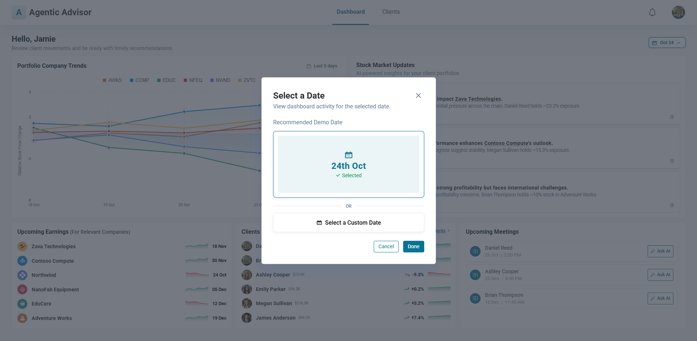

---

### Step 3: Open a Proactive Alert

In **Stock Market Updates**, alert tiles appear. Hovering over the company name in the alert tile reveals a short description of what the company does, handy when the alert references a connected company you aren't tracking directly.

Clicking **View Summary** on an alert tile opens the **Insight modal**, which shows:

- **Client risk profile** (can be set inside DB or through Mem0)
- **Key insight**: the indirect impact being detected (e.g., a customer's poor earnings expected to affect a supplier the client owns stock in)
- **Primary advice**: a concrete action recommendation (e.g., *consider reducing exposure*)
- **Key drivers of the alert**: the specific signals extracted from the triggering earnings report
- **Reasoning behind the advice**: a step-by-step trace of the company relationship path that produced the alert
- A note that **potential risk was detected through an indirect company connection**

> 🧠 This is the **proactive advisory** moment: the stock you hold hasn't released anything yet, but the system has connected an earnings signal from a related company to predict pressure before it shows up in your client's position, giving you time to act.

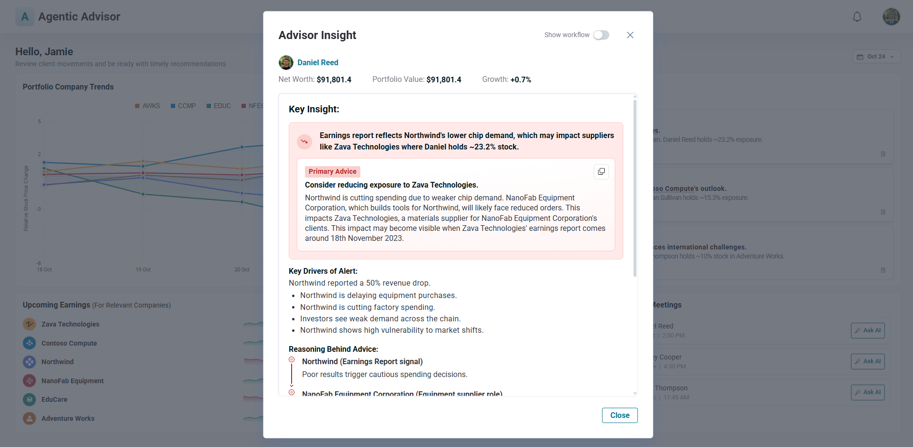
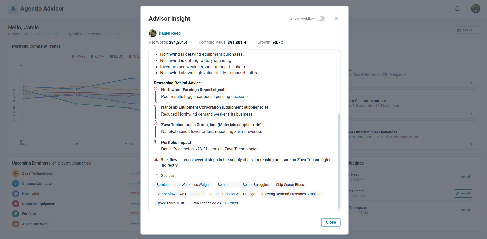

---

### Step 4: Inspect the Multi-Agent Workflow

From the modal, clicking **Show Workflow** opens a live trace of the agents that produced the alert:

```
Event → Event to Impact Mapping (Apache AGE) → Planning Agent → [News Analysis Agent | SEC Filing Analysis Agent | Stock Analysis Agent] → Risk Insight Agent
```

- **Event to Impact Mapping** uses **Apache AGE** to trace the company relationship graph and determine whether the impact is direct or through multiple connected companies; the result (e.g., `indirect_chain`) flows through the workflow state to the Risk Insight Agent
- **Planning Agent** decides which analysis agents to run based on client preferences and risk profiles retrieved from Mem0
- The analysis agents (**News Analysis Agent**, **SEC Filing Analysis Agent**, **Stock Analysis Agent**) run in parallel; for a fresh proactive alert, typically all three fire
- **Risk Insight Agent** combines those outputs with the impact assessment from Event to Impact Mapping, **client portfolio context**, and any **Mem0 preferences** to produce the final, personalized advice

Clicking any agent node in the workflow opens that agent's specific input and output, giving you full visibility into what it received and what it produced.

Two key nodes provide additional detail:

- **Event to Impact**: shows whether the connection between the triggering company and the affected stock is **direct** or **indirect** (through one or more other companies).
- **Relationships**: this option appears inside the **Event to Impact** node only when the connection is indirect. Clicking it opens the **knowledge graph**, where the indirect company connections are visually mapped and highlighted, giving you a clear picture of exactly how the impact was traced.

The graph view can be **maximized**, panned, and closed to return to the workflow trace.

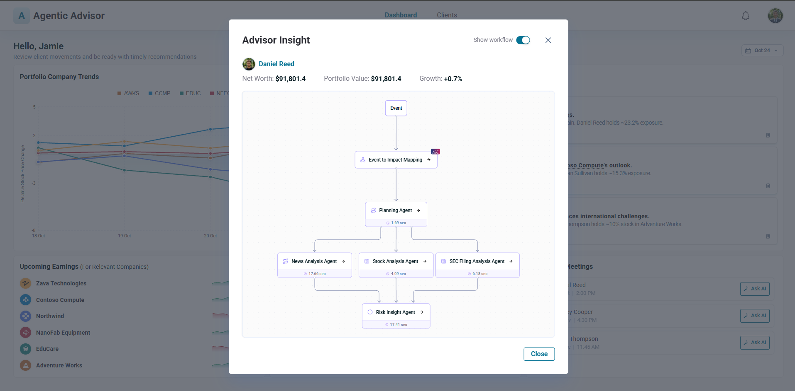
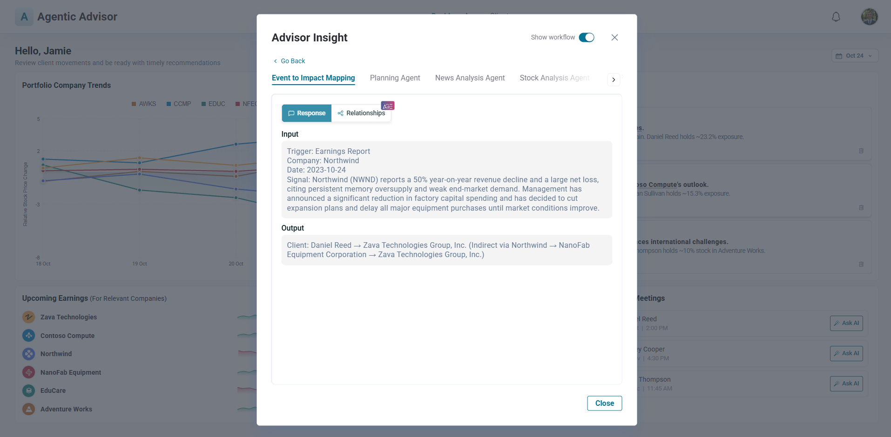
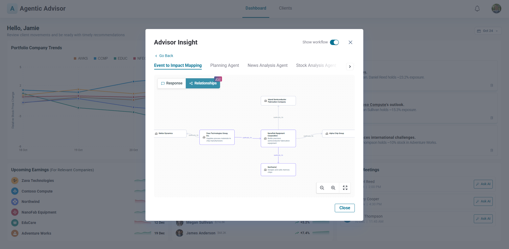
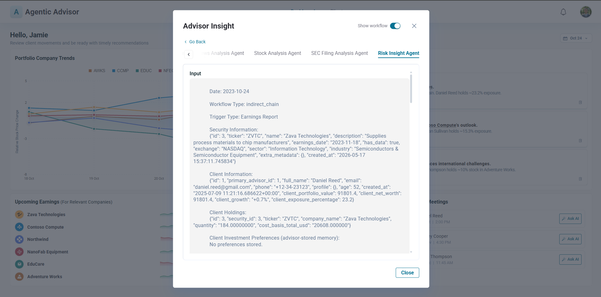

---

### Step 5: Ask AI for Client-Specific Advice

Open **Ask AI** for the client whose position triggered the alert and ask, in plain language, where to reinvest the money you're about to recommend pulling out, anchoring the question to **recent news**.

Because no client preferences have been stored yet, the response is generic but news-grounded. Opening **Show Workflow** confirms that the **Planner triggered only the News Analysis Agent**, exactly matching the intent of the query.

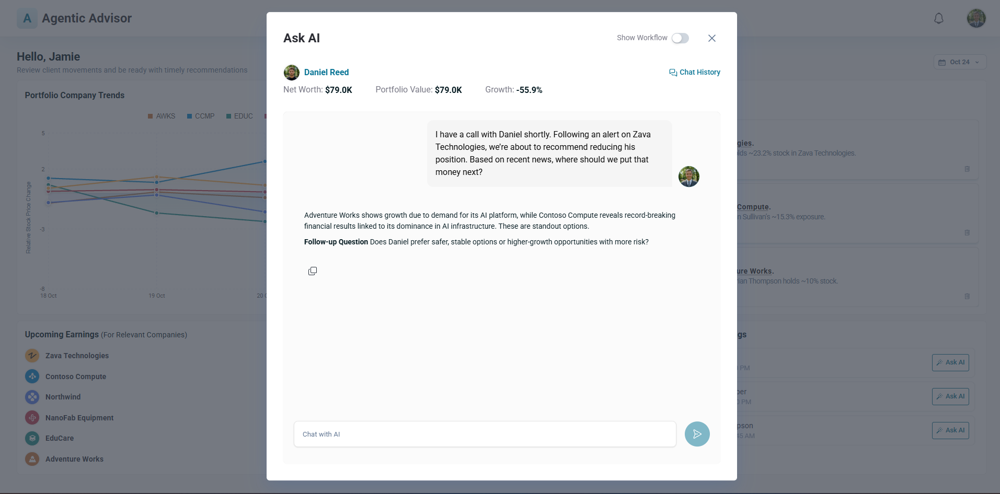
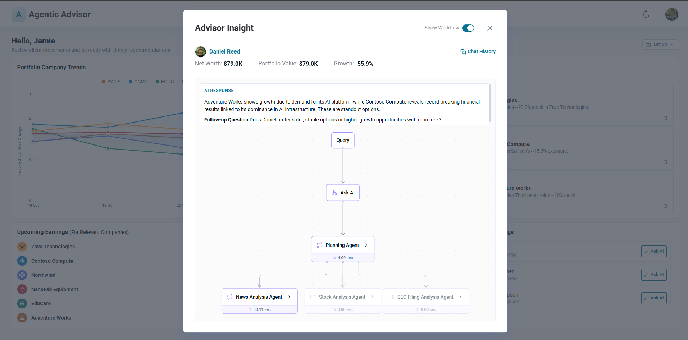

---

### Step 6: Capture Client Preferences with Mem0

In a follow-up, Ask AI surfaces a question about whether the client prefers stability or higher-risk growth. Respond in plain language (e.g., *"This client prefers stability and avoids risk"*).

The system immediately:

- Shows a **"Memory Updated"** indicator in the chat
- Updates the client's risk profile to one of four labels (**Risk Aversive**, **Income Focused**, **Growth Oriented**, or **High Risk**), displayed as a badge in the UI
- Refines its recommendation to match the stored profile

Beyond risk profile, Mem0 can store any client preference you express (sector exclusions, investment themes, company size preferences, etc.). Running **"clear all preferences"** for a client removes both the risk profile label and all stored preferences in one step.

Reopening the workflow shows the **Planner now triggered SEC Filing Analysis Agent and Stock Analysis Agent**; the agent set shifted because both the query type and the newly-captured preference changed.

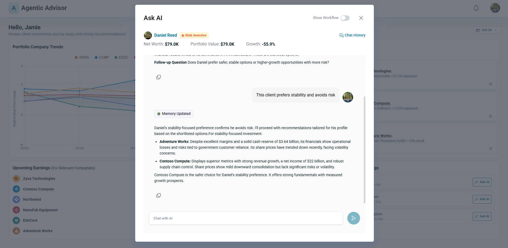
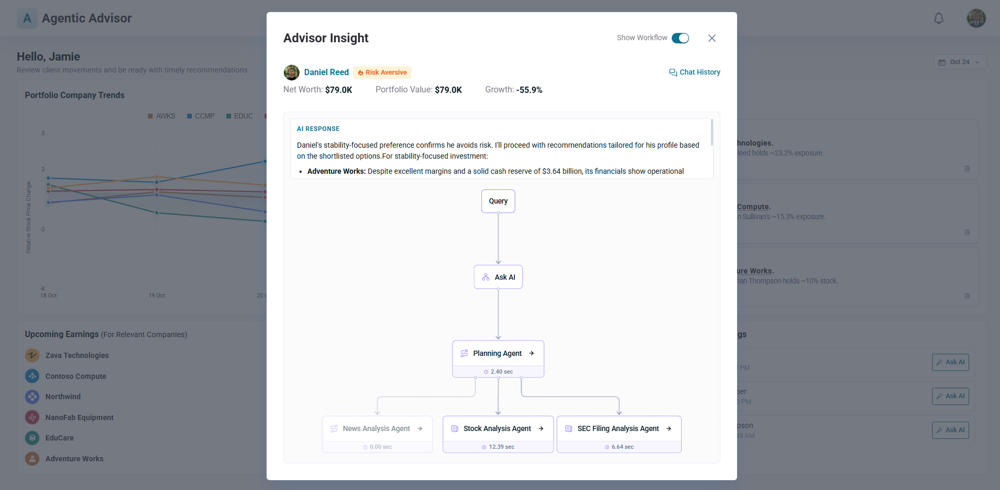

---

### Step 7: Verify That Memory Influences Existing Advice

Returning to the original proactive alert, you'll see:

- The updated **risk profile badge** now displayed on the client profile within the alert (e.g., **Risk Aversive**)
- The primary advice subtly re-framed to reflect the client's stored profile and any additional stored preferences
- A **Mem0 icon** on the Risk Insight node in the workflow; clicking it reveals a **Client Investment Preferences** block in the response, showing exactly how the stored preference flowed into the final advice

The core recommendation is unchanged, but a **personalization layer** is now active for every future request involving this client.

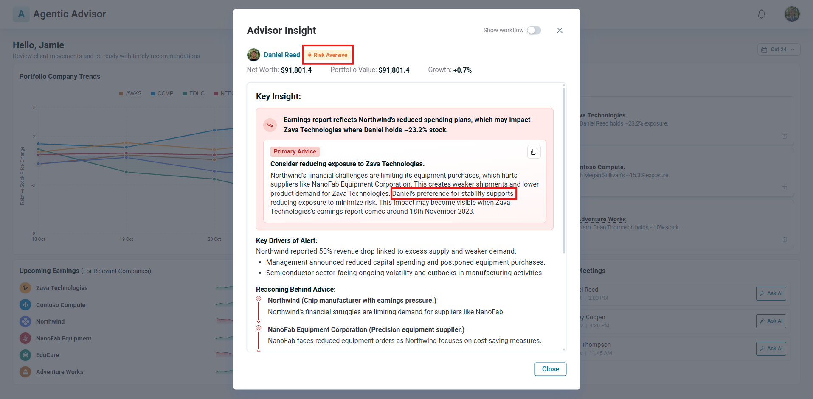
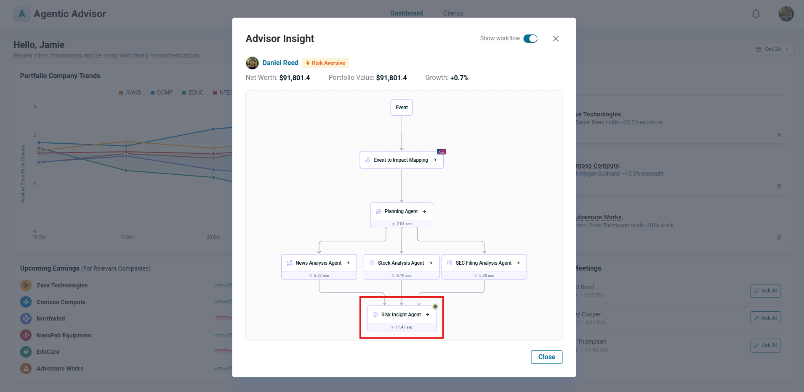

---

### Step 8: Verify the Outcome

To validate that the proactive advisory was correct, use the date picker to **jump forward past the impacted company's earnings date (e.g. November 20)**:

- The position the system advised reducing shows a **clear declining trend** after the earnings release
- The position suggested as a reinvestment target shows an **upward trend** driven by sustained demand

This closes the loop: an **indirect risk signal traced through company connections**, processed by a **multi-agent workflow** and personalized through **Mem0**, produced a recommendation that played out in the market exactly as expected.

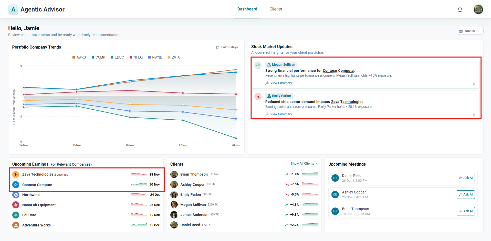
